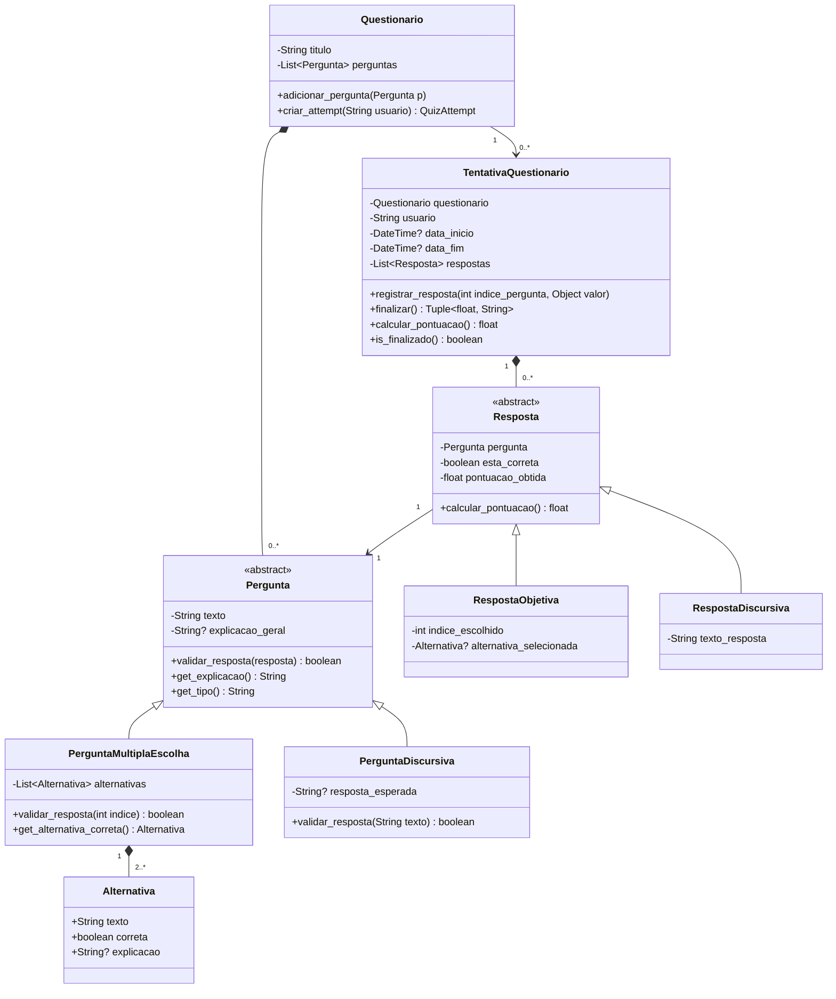
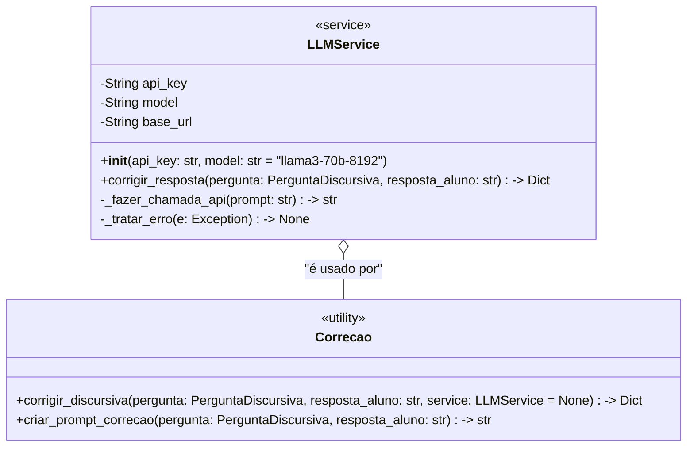

# Guia 4 — Serviço LLM

## Contexto
Você faz parte da equipe responsável por desenvolver um **Sistema de Quiz** educativo.  
O sistema deve permitir a criação de quizzes com perguntas de múltipla escolha ou **discursivas**, validação de respostas e cálculo de pontuação.

Agora, **perguntas discursivas** deverão ser corrigidas por um serviço de LLM (Groq) via API.  
Sua missão é implementar/completar as classes seguindo o **diagrama UML** complementar e as regras abaixo.

---

## Diagrama UML

### 1. Diagrama Principal (mantido exatamente como estava)



### 2. Diagrama Complementar — Integração com LLM (Novo)



---

## Nova Descrição das Classes

### LLMService (Classe de Serviço)
Responsável pela **conexão direta** com o serviço Groq.

**Responsabilidades:**
- Guardar a API Key (deve ser carregada via variável de ambiente `GROQ_API_KEY`)
- Realizar as chamadas HTTP para a API do Groq
- **Tratar todos os erros** (timeout, rate limit, autenticação, JSON inválido, etc.) internamente
- Montar o prompt adequado para correção de questões discursivas
- Retornar apenas o resultado limpo (nunca expor detalhes da API para o resto da aplicação)

**Métodos principais:**
- `corrigir_resposta(pergunta: PerguntaDiscursiva, resposta_aluno: str) → Dict`
  - Retorna dicionário com: `{"correta": bool, "pontuacao": float, "feedback": str, "explicacao": str}`

### CorrecaoUtil (Classe Utilitária)
Classe de alto nível que a aplicação deve usar.

**Responsabilidades:**
- Abstrair o uso do `LLMService`
- Criar o prompt de forma inteligente
- Fornecer interface simples e limpa para o resto do sistema
- Possibilitar uso de mock em testes

**Método principal:**
- `corrigir_discursiva(...)`

---

## Regras de Implementação Importantes

1. **Não modificar** as classes existentes do diagrama principal.
2. A classe `PerguntaDiscursiva` **não deve** conhecer o `LLMService` diretamente.
3. Toda correção de discursiva deve passar pela `Correcao`.
4. O `LLMService` deve:
   - Usar a biblioteca `groq` (ou `requests`)
   - Tratar erros internamente
   - Ter fallback ou mensagem clara em caso de falha na API
5. A API Key **nunca** deve ficar hard-coded.

---

## Como preparar o ambiente

```bash
# 1. Criar venv
python -m venv .venv

# 2. Ativar
# Windows
.\.venv\Scripts\activate
# Linux/macOS
source .venv/bin/activate

# 3. Instalar dependências
pip install -r requirements.txt
```

---