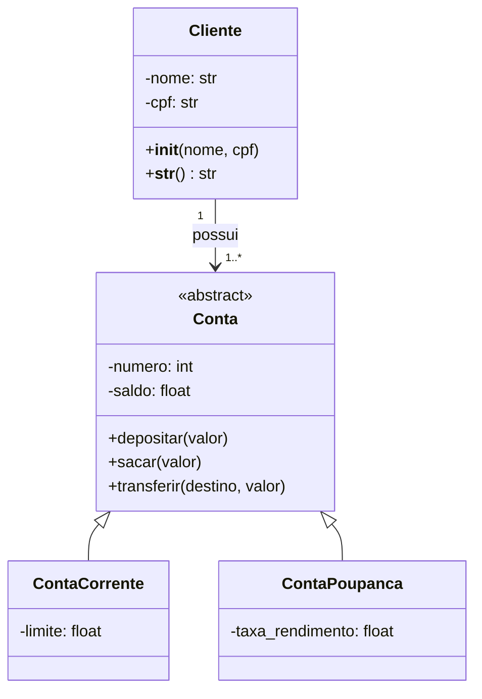

# Guia 5 — Projeto de Sistema com Orientação a Objetos

## Contexto

Agora é sua vez de propor e implementar um **sistema completo** utilizando o paradigma de Orientação a Objetos em Python.

O objetivo deste guia é consolidar os conceitos vistos no curso de POO: classes, objetos, construtores, métodos, encapsulamento, atributos de classe/métodos de classe, herança, polimorfismo, classes abstratas, interfaces (via ABC), composição, etc.

**Exemplos de sistemas sugeridos** (escolha um ou crie o seu):
- Sistema de Banco (conta corrente, poupança, transferência, cliente)
- Sistema de Gerenciamento de Biblioteca
- Sistema de Loja/E-commerce simples (Produto, Carrinho, Cliente, Pedido)
- Sistema de Escola (Aluno, Professor, Disciplina, Turma)
- Sistema de Hospital (Paciente, Médico, Consulta, Exame)

Toda o projeto deve estar explicado conceitualmente em um arquivo Guia5_<Nome_do_Projeto>_README.md contendo o que se segue:

---

## 1. Diagrama UML

### Diagrama de Classes Principal

Mantenha o diagrama **exatamente como está** (atualize apenas se necessário).



---

## Descreva as Classes (Exemplos)

Cliente: Representa o titular da conta.
Conta (abstrata): Define o contrato comum (depósito, saque, transferência).
ContaCorrente: Herda de Conta, permite saldo negativo até o limite.
ContaPoupanca: Herda de Conta, aplica rendimento.

---

## Use este esquema de pastas como Exemplo
```bash
meu-sistema-banco/
├── src/
│   ├── __init__.py
│   ├── cliente.py
│   ├── conta.py
│   ├── conta_corrente.py
│   └── conta_poupanca.py
├── tests/
│   ├── __init__.py
│   ├── test_cliente.py
│   ├── test_conta_corrente.py
│   └── test_sistema_banco.py
├── requirements.txt
├── README.md
└── .gitignore
```

---

## Descreva como preparar o ambiente

Siga rigorosamente uma sequência e descreva ela nesta seção para garantir reprodutibilidade. Exemplo:


### 1. Criar venv

Na pasta do projeto ..\Guia5> executar o comando:

```bash
python -m venv .venv
```

### 2. Ativar ambiente

#### Windows

Na pasta do projeto ..\Guia5> executar o comando:

```bash
.\.venv\Scripts\activate
```

#### Linux/macOS

Na pasta do projeto ..\Guia5> executar o comando:

```bash
source .venv/bin/activate
```

### 3. Instalar dependências

Na pasta do projeto ..\Guia5> executar o comando:

```bash
pip install -r requirements.txt
```

### 4. Testes

Na pasta do projeto ..\Guia5> executar o comando:


```bash
pytest -v
```

ou

```bash
python -m pytest -v
```

### 5. Execução
Na pasta do projeto ..\Guia5> executar o comando:

```bash
python main.py
```

Na tela que abrir você poderá interagir com o sistema da seguinte forma... (descreva funcionalidades, o que o usuário pode experimentar, etc.).

---

