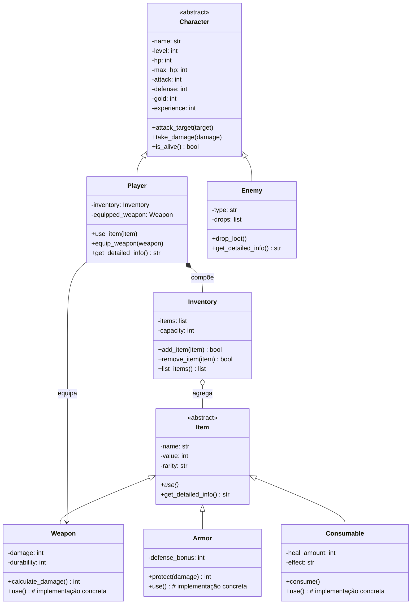

# Guia 5 — Projeto de Sistema com Orientação a Objetos: RPG Python

## Contexto

Este projeto consiste na implementação de um sistema completo de jogo de RPG de texto baseado em turnos executado via terminal. O objetivo principal deste repositório é consolidar de forma prática e aprofundada os conceitos fundamentais e avançados do paradigma de **Orientação a Objetos (POO)** em Python, unindo mecânicas complexas de jogo com a integração de uma Inteligência Artificial generativa via API externa (Groq utilizando o modelo `llama-3.3-70b-versatile`).

Através desta arquitetura, os seguintes conceitos de POO foram exercitados e validados:
- **Classes e Objetos:** Instanciação dinâmica de personagens, heróis, monstros e itens colecionáveis.
- **Encapsulamento:** Controle interno dos estados dos personagens e encapsulamento das lógicas de rolagem de dados (`AttackResult`).
- **Herança:** Especialização de classes bases compartimentadas (`Character` gerando `Player` e `Enemy`; `Item` gerando `Weapon`, `Armor` e `Consumable`).
- **Polimorfismo:** Sobrescrita de métodos funcionais (como o método abstrato `use()` e o comportamento adaptável de `get_detailed_info()`).
- **Classes Abstratas:** Utilização do módulo `abc` para definição de contratos estruturais rígidos para os itens do ecossistema.
- **Composição:** Acoplamento existencial direto de objetos (a mochila `Inventory` instanciada dentro de um `Player`).
- **Métodos Estáticos:** Organização modular de regras de negócio sem mutabilidade de estados (`Combat`, `Merchant`, `NpcAI`).

---

## 1. Diagrama UML

### Diagrama de Classes Principal

O diagrama abaixo mapeia a estrutura de classes desenvolvida para o RPG, respeitando as relações de herança, composição, agregação e associação.



**Explicação Detalhada do Modelo:**

- **Herança (`<|--`)**: `Player` e `Enemy` estendem a assinatura e os atributos comuns definidos em `Character`. O mesmo padrão se aplica a `Weapon`, `Consumable` e `Armor` que derivam da raiz abstrata `Item`.
- **Composição (`*--`)**: O inventário (backpack) é uma parte intrínseca do ciclo de vida do `Player`. Ele é instanciado internamente, garantindo forte acoplamento e dependência mútua.
- **Agregação (`o--`)**: A classe `Inventory` agrega coleções dinâmicas de instâncias derivadas de `Item`. Os itens podem existir de maneira independente fora do inventário (por exemplo, no catálogo global do banco de dados).
- **Associação (`-->`)**: Um objeto do tipo `Character` se associa opcionalmente a um objeto `Weapon` quando empunhado através do atributo `equipped_weapon`.
- **Métodos Estáticos**: Componentes utilitários de fluxo do sistema, como as lógicas puras de turnos de batalha (`Combat`), manipulação transacional financeira da loja (`Merchant`) e barramento com o modelo de LLM (`NpcAI`) não demandam gerenciamento de estado local, atuando como provedores estáticos de contexto do jogo.

---

## 2. Descrição das Classes

- **Character (abstrata)**: Classe base para todos os personagens. Define atributos essenciais: nome, nível, HP, ataque, defesa, ouro e experiência. Possui métodos abstratos para ataque e defesa, além de verificação de vida.
- **Player**: Representa o herói controlado pelo jogador. Possui um inventário (`Inventory`) e pode equipar uma arma (`equipped_weapon`). Permite usar itens, equipar armas e fornece uma descrição detalhada do estado atual.
- **Enemy**: Representa os inimigos encontrados durante o jogo. Possui um tipo e uma lista de itens que podem ser dropados ao ser derrotado. Pode ter comportamentos específicos de ataque.
- **Item (abstrata)**: Define o contrato para todos os itens colecionáveis, incluindo nome, valor, raridade e o método abstrato `use()` que deve ser implementado por cada subclasse.
- **Weapon**: Subclasse de `Item`. Representa uma arma que pode ser equipada, fornecendo um bônus de dano. Possui atributos como dano e durabilidade.
- **Armor**: Subclasse de `Item`. Representa uma armadura que fornece bônus de defesa, reduzindo o dano recebido.
- **Consumable**: Subclasse de `Item`. Representa itens de uso único, como poções de cura, que aplicam um efeito imediato (cura, buff, etc.).
- **Inventory**: Gerencia uma coleção de itens com capacidade limitada. Permite adicionar, remover e listar itens, além de verificar se há espaço disponível.
- **Classes estáticas**:
  - `Combat`: Gerencia a lógica de batalha em turnos entre dois personagens.
  - `Merchant`: Gerencia a compra e venda de itens na loja.
  - `NpcAI`: Integra a API Groq para gerar diálogos dinâmicos com NPCs.

---

## 3. Estrutura de Pastas

```
rpg-project/
├── src/
│   ├── __init__.py
│   ├── character.py
│   ├── player.py
│   ├── enemy.py
│   ├── item.py
│   ├── weapon.py
│   ├── armor.py
│   ├── consumable.py
│   ├── inventory.py
│   ├── combat.py
│   ├── merchant.py
│   └── npc_ai.py
├── tests/
│   ├── __init__.py
│   ├── test_character.py
│   ├── test_combat.py
│   └── test_items.py
├── main.py
├── requirements.txt
├── .env
├── .gitignore
└── README.md
```

---

## 4. Como preparar o ambiente

Siga rigorosamente a sequência de comandos descrita nesta seção para garantir a reprodutibilidade completa do projeto e a execução correta da inteligência artificial.

### 4.1. Criar venv

Na pasta raiz do projeto (`/Guia5`), execute o comando para inicializar o ambiente isolado do Python:

```bash
python -m venv .venv
```

### 4.2. Ativar ambiente

Ative a máquina virtual criada de acordo com o seu sistema operacional:

**Windows**
```bash
.\.venv\Scripts\activate
```

**Linux/macOS**
```bash
source .venv/bin/activate
```

### 4.3. Instalar dependências

Com a venv ativa, instale os pacotes necessários:

```bash
pip install -r requirements.txt
```

### 4.4. Configurar Credenciais da API da IA

O jogo utiliza chaves privadas para se conectar de maneira segura ao modelo remoto. Siga os passos:

1. Crie um arquivo com o nome exato de **`.env`** na raiz do projeto (`/Guia5`).
2. Adicione sua credencial secreta obtida no painel da Groq sem aspas ou espaçamentos:

```
GROQ_API_KEY=gsk_sua_chave_real_aqui
```

> **Nota:** O arquivo `.env` está devidamente listado no `.gitignore`, impedindo qualquer vazamento inadvertido em repositórios públicos.

---

## 5. Testes

Para executar os testes unitários e validar a lógica do sistema, com a venv ativa, execute:

```bash
pytest -v
```

ou

```bash
python -m pytest -v
```

Os testes cobrem:
- Criação e manipulação de personagens
- Lógica de combate
- Operações de inventário (adicionar, remover, listar)
- Uso de itens (poções, armas, armaduras)
- Integração básica com a API (simulada)

---

## 6. Execução e Interação

Para iniciar o jogo e viver a experiência completa, execute:

```bash
python rpg-project/main.py
```

### Fluxo de Interação

Ao executar o comando acima, o jogador é recebido com um menu interativo no terminal. As principais funcionalidades são:

1. **Criação de Personagem** – Escolha o nome e a classe inicial (Guerreiro, Mago, Arqueiro, etc.), que definem os atributos base.
2. **Exploração** – Navegue por masmorras e encontre monstros aleatórios.
3. **Combate em Turnos** – Durante a batalha, você pode:
   - **Atacar** com a arma equipada (causa dano baseado no ataque e na arma).
   - **Usar poção** para recuperar HP.
   - **Fugir** (com chance de sucesso).
4. **Sistema de Evolução** – Ao vencer combates, ganha experiência e ouro; ao acumular XP suficiente, sobe de nível, aumentando seus atributos.
5. **Loja** – Compre ou venda itens com o mercador.
6. **Diálogos com NPCs** – Interaja com personagens não-jogadores que geram respostas dinâmicas usando a IA da Groq (ex.: dicas, missões, lore).
7. **Gerenciamento de Inventário** – Equipe/remova armas e armaduras, use consumíveis, descarte itens excedentes.

### Exemplo de Sessão

```
=== BEM-VINDO AO RPG PYTHON ===
1. Novo Jogo
2. Carregar Jogo
3. Sair
Escolha: 1

Digite o nome do herói: Aric

Escolha sua classe:
1. Guerreiro (Força +2)
2. Mago (Inteligência +2)
3. Arqueiro (Destreza +2)
Opção: 1

--- Aric (Guerreiro) entrou no mundo! ---
O que deseja fazer?
1. Explorar masmorra
2. Visitar loja
3. Falar com NPC
4. Ver inventário
5. Descansar
6. Sair
```

O jogo continua em loop até que o jogador opte por sair ou morra em combate.

---

## 7. Considerações Finais

Este projeto demonstra a aplicação robusta dos pilares da Orientação a Objetos em um contexto lúdico e desafiador, integrando ainda tecnologias modernas de IA. Sinta-se à vontade para expandir o sistema com novas classes, itens, mecânicas de batalha ou até mesmo uma interface gráfica.

Divirta-se e bons códigos! 🎮🐍

```


